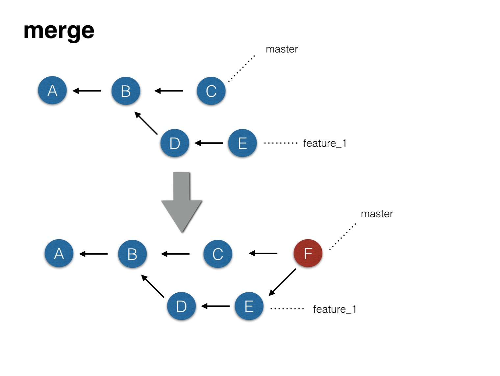
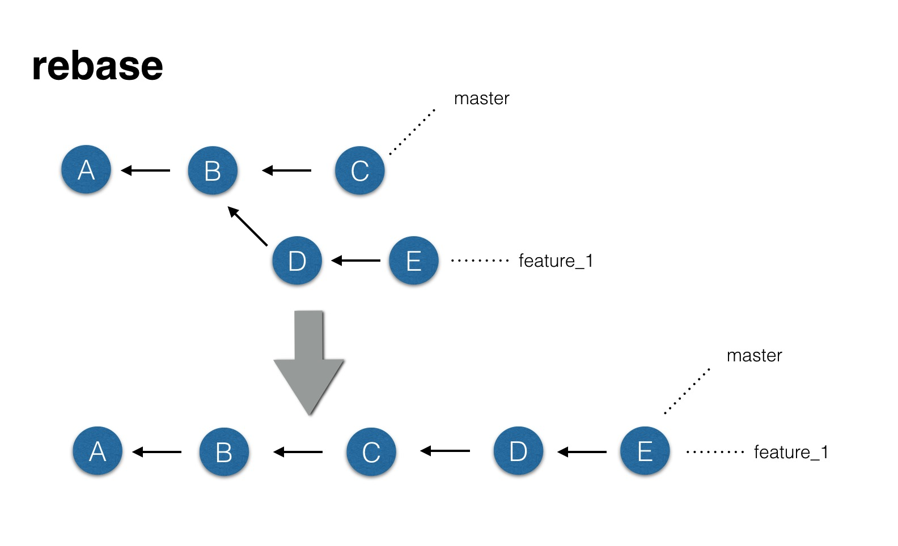

# Git归纳

*   [Git归纳](#git%E5%BD%92%E7%BA%B3)
    *   [前言](#%E5%89%8D%E8%A8%80)
    *   [安装后的配置](#%E5%AE%89%E8%A3%85%E5%90%8E%E7%9A%84%E9%85%8D%E7%BD%AE)
    *   [添加仓库](#%E6%B7%BB%E5%8A%A0%E4%BB%93%E5%BA%93)
    *   [记录每次更新到仓库中并推送到远端仓库](#%E8%AE%B0%E5%BD%95%E6%AF%8F%E6%AC%A1%E6%9B%B4%E6%96%B0%E5%88%B0%E4%BB%93%E5%BA%93%E4%B8%AD%E5%B9%B6%E6%8E%A8%E9%80%81%E5%88%B0%E8%BF%9C%E7%AB%AF%E4%BB%93%E5%BA%93)
    *   [分支](#%E5%88%86%E6%94%AF)
    *   [打标签](#%E6%89%93%E6%A0%87%E7%AD%BE)
    *   [减少麻烦](#%E5%87%8F%E5%B0%91%E9%BA%BB%E7%83%A6)
    *   [总结一下](#%E6%80%BB%E7%BB%93%E4%B8%80%E4%B8%8B)
    *   [Reference](#reference)

## 前言

同上篇一样，归纳一下常用的便于使用。

## 安装后的配置

初次安装时，通过[这个](https://git-scm.com/book/en/v2/Getting-Started-Installing-Git)安装好 **Git** 后，要配置你个人的用户名称和邮件地址，**Git**每次 commit 都会使用这些信息：

    git config --global user.name "[username]"
    git config --global user.email "[email address]"

使用`--global`是全局设置用户名和密码，以后便不用再输入这两条命令，之后会默认使用这里设置的信息。可用`git config --list`查看所有配置信息。

然后我们可以对行的结尾进行设置以及对颜色进行一些个性化设置。

因为在不同系统中行的结尾是不一样的，Git 来帮助你对这些进行标准化。多平台协作时，在 Windows 下把 `core.autocrlf` 设置为 true，而在 Mac 或 Linux 下将 `core.autocrlf` 设置为 input，然后 Git 就会在各自的提交和引入间进行转换。

    git config --global core.autocrlf true
    git config --global core.autocrlf input

而对于颜色，可以帮助我们更方便地区分不同的信息。

    git config --global color.ui auto

如果你指向配置信息对当前的项目的版本库起作用，而不影响全局，可以使用 `--local` 进行设置，它会覆盖全局设置值。

## 添加仓库

除非是使用 **GitHub** 提供的API，否则无法直接通过 **Git** 远程创建一个 **GitHub** 上的仓库 (因为 **GitHub** 不允许这样做)，所以在添加仓库前先通过 **GitHub** 的网页图形界面先创建一个仓库。

如果你很想用带 **GitHub API** 的命令行装逼的话，可以用下面这条命令远程创建仓库：

    curl -u 'USER' https://api.github.com/user/repos -d '{"name":"REPO"}'

`USER`换成你 **GitHub** 账号的用户名，`REPO` 则是你要创建的仓库名。

然后创建一个目录并进入该目录，执行以下命令新建本地仓库：

    git init [project-name]

> 如果不加 project name 就是在当前目录新建一个 Git 代码仓库，如果加了就是新建叫这个 project name 的目录并将其初始化为 Git 仓库。

或者可以克隆远端项目到本地：

    git clone [remote url]

## 记录每次更新到仓库中并推送到远端仓库

本地仓库是由三部分组成的，即工作树 (*working tree*, consists of files that you are currently working on)，暂存区 (也叫index 或 stage, is where commits are prepared)和指向上一次 *commit* 的 *head*。在working tree繁多的文件中，有一些是已经完成了修改的，我们可以先将已经完成的修改放进暂存区中，用：

    git add [file/folder] # add目录时会递归处理其下文件

> 有的地方会把 working tree 叫做 working directory，但为了避免歧义，这里只叫 working tree。

在 *add* 之前，可以用下面这条命令查看未暂存文件的改变：

    git diff

如果想从暂存区中移除某个文件 (不会从working tree中删除)，可以用：

    git rm -cached [relative file name]

如果想删除 working tree 中的文件，可以使用：

    git rm [relative file name] [-f] # `-f` 会进行强制的删除

接着将文件此刻的状态永久地保存到版本历史中，即 *commit* 所有已 *add* 的文件，用：

    git commit -m "[descriptive message]"

如果你 commit 的信息写错了，而此时你还没有 push，你可以用下面这个命令替换掉你最近的一个 commit 的 message：

    git commit --amend -m "[new message]"

而其他未完成的修改可以不 *add* 和 *commit* 先。可以理解为，*add* 是对文件修改状态的选择，*commit* 是对文件修改状态的保存。

可用以下命令查询文件状态：

    git status

然后就可以将本地的所有 *commit* 提交到远端仓库中，用：

    git push [-u] [remote repo] [branch] # `-u`用来设置本地仓库分支将要跟踪的远端 (也叫上流) 仓库的分支 (不存在就会被创建)

但是直接用远端仓库名和分支 *push* 是会报错的，因为你还没设置 *push* 的远端仓库地址，要设置push的目的地仓库及其简称：

    git remote add [shortname] [remote url]

`remote url`是远端仓库的地址，`shortname`是可以用来引用该地址的简写。

想要查看项目提交历史的话，可以用：

    git log [-n] # `-n` 表示最后的5次提交

想根据关键词搜索提交历史的话，可以用：

    git log -S [keyword]

如果你想知道你在本地仓库做过哪些操作，可以使用:

    git reflog

## 分支

除了主分支，我们还可以建立其他分支用于并行开发，这些分支也可以合并进主分支。先罗列下本地的所有分支看看，注意当前分支会带星号并高亮：

    git branch

> `git branch -a` 表示显示本地和远端的所有分支，只用 `-r` 则表示列出所有的远程分支。

我们来创建一个新本地分支：

    git branch [branch name]

要让别人看到你的新分支，你必须通过`git push [remote repo] [branch] `把分支推送到远端仓库才行。如果你不再爱一个分支并想抛弃之，可以用：

    git branch -d [branch name] # 如果是 `-D` 则表示强制删除

不过这只能删除本地分支，要想删除远端仓库，可以用：

    git push -d [remote repo] [branch]

如果想把其他分支合并进当前分支，可以用：

    git merge [branch name]

之后就可以把已被合并的那个分支删掉了：）

想在不同的分支间来去自如？想法不错，用用这个吧：

    git checkout [branch name]

从一个分支上新建一个分支并切换到这个新的分支上：

    git checkout -b [new branch name] [branch name]

切换分支的同时也会将工作树 (*working tree*)转换至相应分支的目录。

另外，既然我们可以向远端仓库 *push* 东西，也可以“拉”东西到本地，即：

    git pull

这会下载远端仓库的所有东西并与本地仓库进行合并，相当于`git fetch [remote url]` 加 `git merge [branch name]`，因为`git fetch [remote url]`只下载远端仓库的所有东西但不进行合并。

当你的远端分支被删除后，你可以使用以下命令删减本地对远端已删减分支的跟踪：

    git remote prune origin

当你用很多分支开发了很多任务，然后这些任务都开发结束了，远端分支也被删了，但是本地对应的一堆分支还没被删，极其遮挡视线，这是不能忍的，一个个删除又是极烦的，你可以使用下面这个命令一次性删除多个本地分支：

    git branch --merged | egrep -v "(^\*|master|dev|skip_branch_name)" | xargs git branch -d

第一条竖杠的左侧部分是列举所有在远端已被合并的分支，然后通过管道 `|` 传递给第二部分进行过滤，除去不想删除的分支，最后传给第三部分进行删除，完美！

## 打标签

为软件的发布版本设置标签是我们常用的手法，也是值得推荐的，这样方便我们了解软件的迭代过程。

首先列出已有标签：

    git tag

然后创建标签：

    git tag <tagname>

要把标签传送到远端仓库中，需执行：

    git push [remote repo] <tagname>

删除本地标签：

    git tag -d <tagname>

删除远端标签：

    git push -d [remote repo] <tagname>

## 减少麻烦

为了省去每次 *push* 时都要输入 *GitHub* 账号和密码的麻烦，我们可以用 *SSH* 的方式连接 *GitHub*。首先创建 *SSH key*：

    ssh-keygen -t rsa -C "[email address]"

一路默认后打开`id_rsa.pub`文件：

    vim ~/.ssh/id_rsa.pub

将该文件具体内容粘贴至 *Setting*->*SSH and GPG keys*->*New SSH key*处，克隆远端项目到本地则采用 *SSH* 协议，其他用到远端仓库 *https* 地址的地方也都采用 *SSH* 地址。详情可见 [Connecting to GitHub with SSH](https://help.github.com/articles/connecting-to-github-with-ssh/)，此处不再赘述。

## 总结一下

对于极常用的一些命令，结合实例总结如下：

* git init git-practice  新建本地仓库
* git add .  将当前目录的修改放到暂存区中
* git commit -m "first commit"  将文件此刻状态永久保存到版本历史中
* git remote add origin https://github.com/yangkean/git-practice.git  设置 *push* 的远端仓库地址及其简称
* git push -u origin master  将所有 *commit* 提交到远端仓库中

最后，如果不想用命令行，除了 *git* 自带的 *GUI*，市面上还有很多好用的 *GUI*，比如 [SourceTree](https://www.sourcetreeapp.com/)。

## 分割线

接下来是当你加入一个用 git 管理代码的团队时会经常使用的命令，它们能帮助你更好的管理团队成员之间的代码提交，简言之，更好的进行团队协作。好，开始吧！

## 撤销/恢复

### **git revert**

这个命令会创建一个新的 commit，这个新的 commit 撤销了之前的 commit 里的变化。比如说你在之前的 commit 里不小心增加了很多个垃圾文件，而 revert 的这个新 commit 会把这些之前添加的垃圾文件都删了，间接达到了撤销之前 commit 的操作。这是通过增加新的 commit 到 git 的历史记录中实现的，并不会改变 git 已有的历史记录，从这个角度讲这是 git 撤销改变最安全的方式，也是多人合作时进行回退时最稳妥的方式，避免你误操作删除了别人的commit (reset 就可以做到)。当然啦，你日后依然能从 git 的历史记录中看到你曾经做过的蠢事！

### **git checkout**

除了我们前面所讲的用于切换分支的操作，我们还可以用 git checkout 来撤销文件的修改，如果你对某些文件进行了一系列修改，然后并不想commit它们，只想把它们恢复成上一个commit时（如果 add 过了就是上一次 add 的时候）的样子，`git checkout [file]` 可以满足你。这个功能其实就是我们在 VSCode 里看到的那个 `放弃更改` 按钮。

> 注意，用这个命令撤销文件修改时，文件应该是已经被 git 跟踪 (*tracked*) 的文件，否则 git 根本不知道文件的存在，就会报错。当一个文件第一次被修改时，也就是从来没被 add 过 (之前也没被 commit 过) 时，只有你能看到文件被修改了，git 啥也不知道，这个时候就要 add 这些文件，由于你没有 commit 过这些文件，当你 add 后再进行修改时，git checkout 所做的操作是撤销掉 add 之后的修改。

> 如果你使用的是 `git checkout [commit]`，就像切换分支一样，git 会把 HEAD 指向那个 commit。更多的细节这里不再赘述，有兴趣可以看参考链接。

### **git reset**

如果你不想让别人知道你曾经提交了一些很糟糕的东西，想直接删除 commit，也就是说直接把 commit 从 git 的历史记录中抹去，好像啥都没发生过那样，你可以使用 git reset，这个命令可以把 HEAD 直接指向某个特定的状态，这样这个 HEAD 新指向的位置之后的 commit 都会被丢弃，你在 git 的历史记录中也看不到被抛弃的 commit 了。这个命令有三种主要模式：

* mixed (默认模式)

    `git reset (--mixed) [commit]` 将 HEAD 指向 [commit] 版本并将 index 恢复到 [commit] 版本

* soft

    `git reset --soft [commit]` 将 HEAD 指向 [commit] 版本，不改变 index 和 working tree

* hard

    `git reset --hard [commit]` 把所有内容（working tree、index、commit历史记录）回退到 [commit] 版本，仿佛回退到某个 commit 版本后之后的 commit 从未发生过，对，就是这个效果

> 注意，git revert commit 是**放弃**指定的这个 commit，git reset commit 是**恢复**到指定的这个 commit。

> 我们可以使用 **HEAD** 来指代最近的 commit 提交，**HEAD** 指代当前分支的最新 commit，如果一个 commit 只有一个parent的话，**HEAD~**或者***HEAD^**指代当前分支最新 commit 的前一次 commit，**HEAD~~**或者**HEAD~2**指代更早的一次 commit，以此类推。但当一个 commit 不止一个 parent 时，情况就没这么简单了，有兴趣可见：[What's the difference between HEAD^ and HEAD~ in Git?](https://stackoverflow.com/a/12527561/6845609)

> 如果你使用的是 `git reset [file]`，那么它的作用刚好与 `git add [file]` 相反，即取消暂存。

### 小总结

我们总结下这三个命令的适用情况，git revert 一般用于撤销公共的改变，也就是说这个改变已经push到远程仓库了，大家都可以看见，鉴于revert是增加commit来进行撤销的，弄错了还有挽救的机会，是比较安全的方式；git checkout 一般用于撤销本地文件的修改（还未commit），把文件恢复成上一次commit时（如果 add 过了就是上一次 add 的时候）的样子，并不会改变 git 的历史记录；git reset 一般用于撤销你 commit 了但是还没有 push 的改变，这些改变会被删掉，不会在远程仓库中看到，就像它们从未发生过。

## 变基

变基 (git rebase) 是啥？这是一个和 git merge 最终结果一致但原理不一致的命令，用图片来感受下。

**merge**

**rebase**

从上面两张图可以大致可以看出，merge 是将两个分支以及它们的共同祖先进行三方合并，生成一个新的提交。而 rebase 是通过改变基底 (base) 的方式，将某一个分支上的所有修改移到另一个分支上，并不产生新的提交，最终使提交历史更加整洁，只有一条直线没有交叉。它一般是这样用的：

    git rebase [newbase] [current branch]

打个比方，比如说你现在在 topic 分支，你想以 master 分支作为新的基底进行变基，现在情况如下：

          A---B---C topic
         /
    D---E---F---G master

当你执行 `git rebase master` 或 `git rebase master topic` 时，会得到如下结果：

                  A'--B'--C' topic
                 /
    D---E---F---G master

> 注意： `git rebase master topic` 相当于先执行 `git checkout topic` 再执行 `git rebase master`

线性上看，也就是：

    D---E---F---G---A'---B'---C'
                |             |
                master        topic

你会发现 master 并没有包含最新的提交，因为 rebase 只是变了基，我们再回到 master 分支进行一次快进合并 (*fast-forward merge*) 即可：

    git checkout master
    git merge topic

现在就得到了我们需要的最终结果：

                              master 
                              |
    D---E---F---G---A'---B'---C'
                              |
                              topic

原理上，执行变基时是首先找到这两个分支（即上面的当前分支 topic 和变基操作的目标基底分支 master）的最近共同祖先 E，然后对比当前分支相对于该祖先的历次提交，提取相应的修改并存为**临时文件**，然后将当前分支指向目标基底 G, 最后以此将之前另存为临时文件的修改依序应用。

注意到上面说的**临时文件**，变基操作的实质是丢弃一些现有的提交，然后相应地新建一些内容一样但实际上不同的提交。所以上面的 A 和 A' 虽然内容一样，但实际是不同的提交。如果你将提交推送至某个公共仓库，然后其他人从这个仓库中拉取提交进行后续工作，此时，你用 `git rebase` 整理了提交并推送到公共仓库，注意到此时公共仓库的的提交历史是丢弃了某些提交的，然而之前拉取过你代码的人是包含这些被丢弃的提交的，而他们不得不将你变基之后的内容再合并生成一次提交，即使它们内容是一致的，这就产生了两个内容一样的提交，使事情变得混乱。如果你看不懂我在说啥，看看这个栗子就懂了：[变基的风险](https://git-scm.com/book/zh/v2/Git-%E5%88%86%E6%94%AF-%E5%8F%98%E5%9F%BA#%E5%8F%98%E5%9F%BA%E7%9A%84%E9%A3%8E%E9%99%A9)。

那么该什么时候用呢？从上面的描述可以略知一二了，在尚未推送至远程仓库时，我们可以用 git rebase 进行合并操作来使提交历史变得简洁。在已经推送到远程仓库时，我们还是老老实实用 git merge 来进行合并操作吧，要不然，你就等着吃翔吧：）。

## 挑拣

我们有时候会出现这样的情况：或是不小心弄错了分支，或是出于其他的考虑，我们需要将一个分支上的某个提交在另一个分支再提交一次，`git cherry-pick [commit]` 就可以完成这个任务。它会将复制一个分支上的提交，然后将它应用到当前分支，生成一个新的提交。假如现在有如下分支状态 (字母表示提交的哈希值)：

        a - b - c - d   master
             \
              e - f - g feature

我们执行：

    git checkout master
    git cherry-pick f

就可以得到：

        a - b - c - d - f   master
             \
              e - f - g feature

cherry-pick 的过程中如果产生冲突，解决冲突后先 add，然后使用 `git cherry-pick --continue`。取消 cherry-pick 有 `git cherry-pick --abort` 和 `git cherry-pick --quit` 两种方式，执行前者会恢复到执行 cherry-pick 之前的状态，不管你的 cherry-pick 是否已经执行了一部分了，后者会保持 cherry-pick 执行到当前的状态，然后退出 cherry-pick 操作。另外，cherry-pick 是可以操作多个 commit 的，此处不再赘述，有兴趣可以查看[官方文档](https://git-scm.com/docs/)。

## 移动

    git mv [source] [destination]

就是移动或者重命名文件。

## 清理

    git clean [path] [-n] # `-n` 会显示哪些会被删

从 working tree 中递归删除当前目录下未被 Git 跟踪 (*untracked*) 的文件。如果指定了 path，就只会操作这些 path 下的文件。

## 保存当前状态

假设我们现在正在进行工作，修改了一些文件，添加了一些文件。这时我们突然想切换到另一个分支工作，但是又不想commit当前的修改，这是我们很常遇到的情况，毕竟有时候的改动还不完全，commit了的话只会污染提交历史，那该怎么办呢？可以使用 git stash，这是个非常实用的命令。

    git stash

你只要运行一下上面这个命令，Git 当前的状态就被保存了，然后运行下 git status，你会发现当前的目录是干净的，没有任何修改，那是因为之前的修改都被暂时**藏**起来了，你现在可以暂时切换到其他分支工作了。需要注意的是，如果文件没有被跟踪过，记得 add 一下再 stash。

好了，当我已经完成了其他分支的工作再回到本分支，该怎么恢复我之前的工作呢？我们先看下我们隐藏过的工作列表：

    git stash list

这会打印类似下面的描述：

    stash@{0}: WIP on submit: 6ebd0e2... Update git-stash documentation
    stash@{1}: On master: 9cc0589... Add git-stash

这些就是你曾经藏匿过的东西，`stash@{0}` 是一个标识，可用于恢复时指定恢复哪个藏匿的工作状态，不指定时默认是恢复最新的也就是最上面那个工作状态。那如何恢复呢？

只需执行：

    git stash pop/apply [stash id]

pop 和 apply 都能恢复刚才藏起来的工作，区别在于，前者会将藏匿状态 (即某条 `stash@{x}`) 从 stash list 中移除，而后者不会，stash id 就是 `stash@{x}` 中的 `x`，用于指定恢复哪个工作状态，当你觉得 stash list 中的状态项已经没用时，`git stash clear` 可以删除 stash list 中所有的状态项。

## 展示对象

    git show [objects]

这个命令是用来展示对象的信息的，这里的对象指的是 blobs（文件）、trees、tags 和 commits。就是查看这些对象的一些相关信息，具体可以查看[文档](https://git-scm.com/docs/git-show)。

## 寻找责任负责人

    git blame [file]

这个命令会打印出这个文件的每一行是在什么时候被什么人修改过。

## 其他

后续有常用的再加吧，git 命令实在太多了○|￣|_。

## Reference

* [git - the simple guide](http://rogerdudler.github.io/git-guide/index.html)
* [Pro Git - 2nd Edition](https://git-scm.com/book/en/v2)
* [GitHub Help](https://help.github.com/)
* [搬进 Github](http://www.mengma.com/class/lessonread/15/2)
* [GitHub Git Cheat Sheet](https://services.github.com/on-demand/downloads/github-git-cheat-sheet/)
* [What's the difference between Git Revert, Checkout and Reset?](https://stackoverflow.com/questions/8358035/whats-the-difference-between-git-revert-checkout-and-reset)
* [Git workflow](https://backlog.com/git-tutorial/git-workflow/)
* [When to Use Git Reset, Git Revert & Git Checkout](https://dev.to/neshaz/when-to-use-git-reset-git-revert--git-checkout-18je)
* [Resetting, Checking Out & Reverting](https://www.atlassian.com/git/tutorials/resetting-checking-out-and-reverting)
* [Git 菜单](https://github.com/geeeeeeeeek/git-recipes/)
* [What is a bare Git repository?](https://mijingo.com/blog/what-is-a-bare-git-repository)
* [3图带你理解rebase和merge](https://www.css3.io/rebase-vs-merge.html)
* [Git 分支 - 变基](https://git-scm.com/book/zh/v2/Git-%E5%88%86%E6%94%AF-%E5%8F%98%E5%9F%BA)
* [Git Reference](https://git-scm.com/docs/)
* [What's different between `--abort` and `--quit` as sequencer subcommands for `cherry-pick`?](https://stackoverflow.com/questions/55431768/whats-different-between-abort-and-quit-as-sequencer-subcommands-for-ch)
* [Git进阶命令讲解：squash,fixup,stash](https://chuansongme.com/n/447693)
