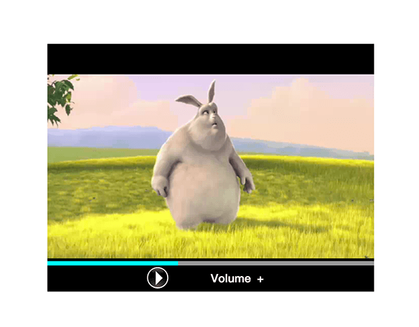
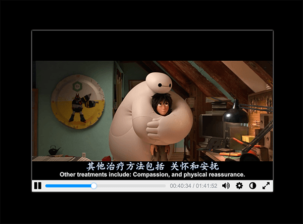

# 实现一个自定义的 html5 播放器

*   [实现一个自定义的 html5 播放器](#%E5%AE%9E%E7%8E%B0%E4%B8%80%E4%B8%AA%E8%87%AA%E5%AE%9A%E4%B9%89%E7%9A%84-html5-%E6%92%AD%E6%94%BE%E5%99%A8)
    *   [前言](#%E5%89%8D%E8%A8%80)
    *   [写播放器之前需要知道的](#%E5%86%99%E6%92%AD%E6%94%BE%E5%99%A8%E4%B9%8B%E5%89%8D%E9%9C%80%E8%A6%81%E7%9F%A5%E9%81%93%E7%9A%84)
    *   [隐藏原生播放器的控制栏](#%E9%9A%90%E8%97%8F%E5%8E%9F%E7%94%9F%E6%92%AD%E6%94%BE%E5%99%A8%E7%9A%84%E6%8E%A7%E5%88%B6%E6%A0%8F)
    *   [添加播放暂停功能时的小插曲](#%E6%B7%BB%E5%8A%A0%E6%92%AD%E6%94%BE%E6%9A%82%E5%81%9C%E5%8A%9F%E8%83%BD%E6%97%B6%E7%9A%84%E5%B0%8F%E6%8F%92%E6%9B%B2)
    *   [全屏有毒](#%E5%85%A8%E5%B1%8F%E6%9C%89%E6%AF%92)
        *   [毒一：兼容](#%E6%AF%92%E4%B8%80%E5%85%BC%E5%AE%B9)
        *   [毒二：异步执行却不返回 promise](#%E6%AF%92%E4%BA%8C%E5%BC%82%E6%AD%A5%E6%89%A7%E8%A1%8C%E5%8D%B4%E4%B8%8D%E8%BF%94%E5%9B%9E-promise)
        *   [毒三：全屏的实现原理竟然不一样](#%E6%AF%92%E4%B8%89%E5%85%A8%E5%B1%8F%E7%9A%84%E5%AE%9E%E7%8E%B0%E5%8E%9F%E7%90%86%E7%AB%9F%E7%84%B6%E4%B8%8D%E4%B8%80%E6%A0%B7)
        *   [毒四：全屏时自定义组件被隐藏了](#%E6%AF%92%E5%9B%9B%E5%85%A8%E5%B1%8F%E6%97%B6%E8%87%AA%E5%AE%9A%E4%B9%89%E7%BB%84%E4%BB%B6%E8%A2%AB%E9%9A%90%E8%97%8F%E4%BA%86)
    *   [弹幕功能的实现](#%E5%BC%B9%E5%B9%95%E5%8A%9F%E8%83%BD%E7%9A%84%E5%AE%9E%E7%8E%B0)
        *   [position、left 和 transition](#positionleft-%E5%92%8C-transition)
        *   [用 transform 秒杀渣渣 position、left](#%E7%94%A8-transform-%E7%A7%92%E6%9D%80%E6%B8%A3%E6%B8%A3-positionleft)
        *   [关于基本的碰撞检测](#%E5%85%B3%E4%BA%8E%E5%9F%BA%E6%9C%AC%E7%9A%84%E7%A2%B0%E6%92%9E%E6%A3%80%E6%B5%8B)
    *   [最后的啰嗦 ～= 吐槽](#%E6%9C%80%E5%90%8E%E7%9A%84%E5%95%B0%E5%97%A6--%E5%90%90%E6%A7%BD)

## 前言

事情要从 *long long ago* 说起。去年大概年中的时候兴致大发写了个 *html5* 的播放器，大概是下面这个样子的 (捂脸)：



我今年再看到这个播放器的时候，表情大概就是上图中那只兔子 (姑且算它是兔子吧)的样子。没办法，当年 *js* 写得还不够多，*html5* 的 *API* 也知道的不多。今年年初的时候已经基本熟悉了 *ECMAScript 6*，对 *JavaScript* 的很多细节和坑都有了更深的理解，也略懂设计模式了，于是计划着重构这个丑陋的播放器，顺便增加我一直想增加的弹幕功能。结果给自己开了个大坑，用了一个多月才最终完成，其实大部分时间都在 *debug* :(。所幸结果还算满意，新生代样子如下：



这万恶的花了我一个多月的播放器可以在 [这里](https://yangkean.github.io/YangPlayer/) 体验。

## 写播放器之前需要知道的

这篇文章并不打算把实现细节讲得面面俱到，因为代码非常多，单纯地罗列没有意义，所以这篇文章只讲一些实现的思想和一些需要注意的坑，代码可以参考我上面给的链接。

从 [浏览器对 *video* 标签的支持](http://caniuse.com/#search=video) 可以知道现在的主流浏览器对 *html5* 的 `video` 标签支持已经非常好了，无需担心过多的兼容性问题。

主流浏览器的原生播放器都提供了基本的播放暂停、进度条拉动、音量调节、全屏的功能，但是各家浏览器的播放器样式都不一样，有的丑得不忍直视，有的看起来还行，各家还有自己增加的额外功能，如下载、分出一个小播放器播放之类的功能，同样的产品在不同的平台表现应接近一致，所以首先应该把播放器的原生样式隐藏，再利用 [*video element API*](https://html.spec.whatwg.org/multipage/embedded-content.html#the-video-element) 和 [*media elements API*](https://html.spec.whatwg.org/multipage/embedded-content.html#media-elements) 控制播放器的行为和增加额外的功能。

## 隐藏原生播放器的控制栏

一般的方法是直接把 `controls` 属性从 `video` 标签中删除即可，在播放器小屏的时候确实不出现控制栏了，但当你用 *Fullscreen API* (后面会讲) 控制播放器全屏时，*Chrome / Safari / Opera* 的播放器底部就会出现控制栏，而且打开控制台是无法定位控制栏的，更不要说用样式来隐藏这个控制栏了。这是因为原生的播放器封装了播放器组件，而这些组件是和主 *DOM* 树分开的，外界无法直接修改和访问，需借助 *Shadow DOM* 来访问修改，但目前只有 *Chrome / Safari 10+ / Opera* 支持
*Shadow DOM* ，但是只有它们会在全屏时会出现控制栏哎哈哈，刚好。随便在 *html* 文件中写一个 `video` 标签，对于 *Chrome*，打开控制台，再点开控制台右上角的 *Settings* (如下)，然后 *Preferences* -> *Elements* -> *Show user agent shadow DOM*。


回到控制台，你就会看到 `video` 标签下多了个 *shadow root* (如下)：


借助 *shadow root* 下的元素的伪类 (*pseudo*)，我们便可以修改播放器组件的样式。要永久地隐藏 *Chrome / Safari / Opera* 的控制栏，我们只需要在 *CSS* 样式中加入下面这条：

```css
video::-webkit-media-controls-panel {
  display: none !important;
}
```

## 添加播放暂停功能时的小插曲

在 *HTML* 官方文档的 *[media elements API](https://html.spec.whatwg.org/multipage/embedded-content.html#media-elements)* 中，对于 `play()` 和 `pause()` 方法是这样定义的：

```
Promise<void> play();
void pause();
```
`play()` 方法返回的是 *promise*，说明它是异步执行的，当你频繁地切换播放暂停状态时，可能会报 *"The play() request was interrupted by a call to pause()"* 的错误，这是因为根据 [官方文档](https://html.spec.whatwg.org/multipage/embedded-content.html#dom-media-pause) 所说，如果在 `play()` 方法的 *promise* 被 *resolved* 之前触发 `pause()` 方法，`pause()` 方法会用 *"AbortError DOMException"* 去 *reject* `play()` 方法还在 *pending* 的 *promise*。虽然官方文档这么说，但是这种报错只在 *Chrome* 最近某些版本中发生，于是乎被标记为了一个 *[bug](https://bugs.chromium.org/p/chromium/issues/detail?id=593273)*，我自己测试在 *55 (64-bit), macOS Sierra* 上仍然报错，但在 *Chrome 56.0.2924.87 (64-bit), macOS Sierra* 上就不报错了。这个报错其实不影响视频的播放，但是看着红叉叉的报错总有些不爽，所以为了消除某些版本 *Chrome* 的报错可以用下面的代码把红色的报错转化为自定义的输出提醒：

```javascript
let error = 'AbortError: The play() request was interrupted by a call to pause().';
let promise = document.querySelector('video').play();

// `this.player.play()` in firefox 51 doesn't return a promise
if(promise) {
    promise
    .catch((e) => {
      if(e.toString() === error) {
        console.log('Abort `play` promise.');
    
        return;
      }
      
      console.log(e);
    });
}
```

值得一提的是，至少在 *Firefox 51.0.1* 中的 `play()` 方法还是不返回任何东西的，和 `pause()` 方法一样。

## 全屏有毒

### 毒一：兼容

要实现播放器的全屏，可以使用 *[Fullscreen API](https://developer.mozilla.org/en-US/docs/Web/API/Fullscreen_API)*，虽然根据 [浏览器对 *Fullscreen API* 的支持](http://caniuse.com/#feat=fullscreen)，主流浏览器都是部分支持 *Fullscreen API*，但是已经足够我们完成基本的需求了，首先需要用浏览器前缀对 *API* 标准方法支持一波：

```javascript
function getBrowserSupportObj() {
  let fnMap = [
    // standard method
    [
      'requestFullscreen',
      'exitFullscreen',
      'onfullscreenerror',
      'onfullscreenchange',
      'fullscreenElement',
      'fullscreenEnabled',
      'fullscreen',
    ],
    // Blink (Chrome & Opera) / Edge / WebKit (Safari)
    [
      'webkitRequestFullscreen',
      'webkitExitFullscreen',
      'onwebkitfullscreenerror',
      'onwebkitfullscreenchange',
      'webkitFullscreenElement',
      'webkitFullscreenEnabled',
      'webkitIsFullScreen',
    ],
    // Gecko (Firefox)
    [
      'mozRequestFullScreen',
      'mozCancelFullScreen',
      'onmozfullscreenerror',
      'onmozfullscreenchange',
      'mozFullScreenElement',
      'mozFullScreenEnabled',
      'mozFullScreen',
    ],
    // IE 11
    [
      'msRequestFullscreen',
      'msExitFullscreen',
      'onmsfullscreenerror',
      'onmsfullscreenchange',
      'msFullscreenElement',
      'msFullscreenEnabled',
      null,
    ],
  ];
  let ret = {};

  for(let i = 0; i < fnMap.length; i++) {
    let val = fnMap[i];

    if(val[1] in document) {
      for(let j = 0; j < val.length; j++) {
        ret[fnMap[0][j]] = val[j];
      }

      return ret;
    }
  }

  return false;
}
```

用上面这个函数就可以对付除较低版本的大部分主流浏览器的兼容问题了。好，下一个问题 :)

### 毒二：异步执行却不返回 *promise*

上面说到主流浏览器都是部分支持 *Fullscreen API*，很大一部分原因在于 `Element.requestFullscreen()`
方法和 `Document.exitFullscreen()` 这两个最重要的方法都是异步执行的，按照最新官方文档应该返回一个 *promise*，可是主要的厂商们都不返回一个 *promise* (衰)，下图中的绿色块就是部分支持 *Fullscreen API* 而且不返回 *promise* 的。


这就会导致一些严重的问题，因为在你切换屏幕模式的时候会修改一些样式或触发一些行为，而这些操作是同步执行的，在发起 `Element.requestFullscreen()`
或 `Document.exitFullscreen()` 请求之后，这些同步执行操作就会开始，但这些操作会在真正进入全屏状态或退出全屏状态前就结束，可是实际上我们是需要完全进入全屏状态或退出全屏状态后才执行这些同步操作的。又不返回 *promise*，叫人如何是好。幸运的是，我们还有 `Document.onfullscreenchange()` 方法，这个方法会在屏幕状态真正改变之后被触发，我们只需要把那些要在屏幕状态改变之后做的同步操作放到一个 *callback*
函数中，然后执行：

```javascript
document.addEventListener('onfullscreenchange', callback, false);
```

好，下一个问题 :)

### 毒三：全屏的实现原理竟然不一样

*Firefox* 的渲染引擎 *Gecko* 和 *Blink (Chrome & Opera) / Edge / WebKit (Safari)*系列的渲染引擎在实现全屏的原理上是不同的。*Gecko* 只是单纯地把元素撑大到占满整个屏幕，被撑大元素的兄弟 (*siblings*) 仍然相对被撑大元素的父亲 (*parent*) 来布局且会被撑大元素覆盖。*Blink (Chrome & Opera) / Edge / WebKit (Safari)* 系列则是撑大元素但其兄弟是相对撑大的元素来布局的。博主的实现中控制栏是作为 `<video>` 元素的兄弟而存在的，所以后者的表现方式不会出问题，反而在 *Firefox* 上我的控制栏被覆盖了。这个时候，可以将 `video` 元素和其兄弟放到一个 `div` 元素中，对于 *Firefox* 就撑大这个 `div` 元素，对于其他渲染引擎则撑大 `div` 下的 `video` 元素。如果你是其他实现，可以参考 *[presention differences](https://developer.mozilla.org/en-US/docs/Web/API/Fullscreen_API#Presentation_differences)*。

好，下一个问题 :)

### 毒四：全屏时自定义组件被隐藏了

当播放器全屏时，你发现你自己定义的组件不见了，但是通过开发者工具左上角的 *Select* 工具你是能找到你自己定义的组件的，布局位置也是正确的，它们就像是添加了 `visibility: hidden;` 的样式，究竟是怎么回事？现在打开开发者工具查看相关的样式属性，可以看到下图的样式 (此处是 *Chrome* 的例子)，仔细一看发现全屏时播放器的 `z-index` 被设置为了 2147483647，这么高的 `z-index` 值，难怪我的组件无法显示。为了解决这个问题，你需要将你的组件的 `z-index` 值设置为大于等于 2147483647。


我测试了 *Chrome 56*、*Firefox 51*、*Safari 10*、*Opera 43*，发现都要将自定义组件的 `z-index` 值设置为大于等于 2147483647。为什么浏览器开发者们要把 `z-index` 设置为这个值？这个值实际上是 32 位有符号整数的最大值，即 2<sup>31</sup> - 1，也是 32 位操作系统上所能表示的最大正整数，现在的操作系统大多是 64 位了，32 位操作系统也将渐渐退出历史舞台，所以设成这个值大概是个历史遗留问题吧。现代的浏览器中你可以把 `z-index` 设置为任意值，但是大部分浏览器都把 `z-index` 限制在了 -2147483648 ~ 2147483647 这个区间，即 -2<sup>31</sup> ~ 2<sup>31</sup> - 1，超过这个区间也会被处理为最接近这个区间的值。

好，暂时没问题了 :)

## 弹幕功能的实现

相信年轻人都知道第二大同性交友网站 [Bilibili](https://www.bilibili.com/)，那么也一定知道它们家是以弹幕为特色的。那么，怎么来简单地实现这种弹幕效果呢？一条条弹幕的移动，实则为一个个 `div` 元素的移动，这些 `div` 元素随着播放器到达某个时间点而出现，从播放器右边慢慢移动到播放器左边。有啦，用 `position`、`left`、`transition` 试试。

### *position*、*left* 和 *transition*

效果如下：

https://jsfiddle.net/YangKean/1js4ufqz/14/embedded/js,html,css,result/dark/
    
这个方法其实是有问题的，因为用 *position* 和 *left* 移动 `div` 元素会导致页面的重排 (*reflow*) 和 重绘 (*repaint*)，这将大大降低播放器的性能，并且弹幕会出现卡顿的现象。另外，如果发送的弹幕不是连续的 (中间有空格、逗号)，在移动的过程中会出现弹幕断节的现象，你说看不太明显啊。这是因为弹幕的规模还不够大，你可以看看 [这个效果](http://codepen.io/paulirish/pen/nkwKs)，就知道在规模足够大的时候用 *position* 和 *left* 移动元素会显得多么不理智了。那么，用什么办法呢？可以用 *transform* 移动元素，这是唯一一个除 *opacity* 外在改变时既不触发重排 (*reflow*) 也不触发重绘 (*repaint*) 的属性，可以大大地提高播放器的性能和弹幕的流畅度。

### 用 *transform* 秒杀渣渣 *position*、*left*

首先感受一波复杂场景下 *transform* 的厉害，请点击 [这里](http://codepen.io/paulirish/pen/LsxyF)。

更改后的弹幕效果如下：

https://jsfiddle.net/YangKean/uch3sfch/3/embedded/js,html,css,result/dark/
    
不是我说啊，这个 *transform* 怎么这么高性能啊？好流畅的说 :)

### 关于基本的碰撞检测

当同一时间的弹幕一多，许多弹幕就有可能重叠，这会大大降低用户体验，所以需要做一些简单的碰撞检测，尽量减少重叠的发生。原理是可以计算前后两条同高度的弹幕的距离，当后面那条弹幕的头部到前面那条弹幕的头部的距离小于前面那条弹幕的宽度时，重叠就发生了，这个时候应该把后面那条弹幕向后移动足够距离以至不会与前面的那条弹幕重叠。简单的碰撞检测大概可以这样实现，代码就不贴了，需要参考可以看我的 *[github](https://github.com/yangkean/YangPlayer)*。

## 最后的啰嗦 ～= 吐槽

就弹幕功能来说，还有很多需要做，例如暂停、继续、弹幕的着色、顶部弹幕和滚动弹幕的处理等等，可以说这是一个最复杂的功能了，需要耐心地写。

还有啊，话说，同样是苹果的产品，*Safari* 和 *MacBook*、*iPhone* 的差距真不是一般大，在写这个播放器的时候，好几次都被 *Safari* 莫名地坑了，打开控制台再切换到全屏的时候竟然崩了，有时甚至感觉 *Safari* 已经仅此于 *IE* 了，不过据说 *Safari* 退居苹果产品二线了，就算了 :)。

基于播放器的特殊，尤其需要考虑优化性能，否则运行起来而且弹幕量大的时候，简直惨不忍睹。用 *cssText* 合并多条需要动态改变的 *css* 属性，非动态的又有很多条属性的修改应该统一放到 *css* 文件中，再用 *class* 属性来修改元素的样式，尽最大努力减少页面的重排 (*reflow*) 和 重绘 (*repaint*)。

就酱。

谨以此文致敬我那逝去的青春！