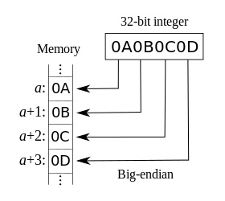
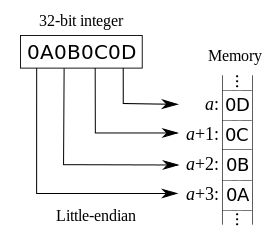

# 通用解决方案 —— UTF-8

## 前言

写这篇东西，是因为我在前台疯狂地输各种字符提交给后台时，不仅在数据库看到了一堆乱码，还报错了。

## 目录

*   [通用解决方案 —— UTF-8](#%E9%80%9A%E7%94%A8%E8%A7%A3%E5%86%B3%E6%96%B9%E6%A1%88-utf-8)
    *   [前言](#%E5%89%8D%E8%A8%80)
    *   [目录](#%E7%9B%AE%E5%BD%95)
    *   [麻烦催生发明](#%E9%BA%BB%E7%83%A6%E5%82%AC%E7%94%9F%E5%8F%91%E6%98%8E)
    *   [Unicode 的诞生](#unicode-%E7%9A%84%E8%AF%9E%E7%94%9F)
    *   [UTF 家族](#utf-%E5%AE%B6%E6%97%8F)
    *   [主角要登场了](#%E4%B8%BB%E8%A7%92%E8%A6%81%E7%99%BB%E5%9C%BA%E4%BA%86)
    *   [一起来使用 UTF-8 吧](#%E4%B8%80%E8%B5%B7%E6%9D%A5%E4%BD%BF%E7%94%A8-utf-8-%E5%90%A7)
    *   [Reference](#reference)

## 麻烦催生发明

计算机这家伙比较“蠢”，只会跟0和1组成的数字代码打交道。为了存储字符，需要为每一个字符分配一个数字 (实际为一个 0-1 编码序列)，计算机要操作字符时，操作相应的数字即可。为了显示现代英语，ANSI (*American National Standards Institute*) 1963 年提出了 ASCII (*American Standard Code for Information Interchange*)，用7位二进制数定义了共 128 个字符，除无法显示的控制字符外，只能显示 26 个英语字母、阿拉伯数字和英式标点符号。但是欧洲有很多非英语的语言，用 ASCII 是很难完整显示它们的，于是有了 EASCII (*Extended ASCII*)。EASCII 将 ASCII 由 7 位扩展到 8 位，可以定义 256 个字符，可以解决部分西欧语言的显示问题了。世界上还有很多种语言无法用 EASCII 显示，只能各自的语言各自定义自己的编码系统，如中文的 GB 2312、日文的 JIS X 0201 等，要显示哪种语言就采用相应的编码系统，当你要处理多个不同语言的文件时，你就需要频繁地换编码系统，十分麻烦，而且，如果一份文件同时包含多种语言呢？嗯，看来是时候需要发明一些东西来提高生产力了。

## Unicode 的诞生

为了提高生产力，ISO (*International Organization for Standardization*) 制定了 ISO 10646 标准，这个标准定义了UCS (*Universal Character Set*)，即通用字符集，这个字符集包含了所有需要显示的语言的字符，并不是所有的系统都需要支持 UCS 的一些先进机制，于是 ISO 将 UCS 划分为 3 个实现等级，其中实现等级 3 是最完整的，支持所有的 UCS 字符。同时期的另一个组织 Unicode联盟 (*Unicode Consortium*) 制定了另一套包含所有字符的标准 —— Unicode 标准，但是两个不同的统一字符集并非这个世界想要的，幸运的是后来这两个字符集项目一起合作并互相兼容了，Unicode 相当于 ISO 10646 实现等级 3，有关 ISO 10646 和 Unicode 的详细区别可见 [what is the difference between Unicode and ISO 10646?](http://www.cl.cam.ac.uk/~mgk25/unicode.html#diffs)，此处不再赘述。

Unicode 在一些细节上做得更好，更适合作为实现的参考，所以也得到了更广泛的使用。Unicode 标准建立了一个编码表，每一个字符对应一个唯一的数字，不管是什么平台、什么程序、什么语言，你均可以通过 Unicode 操作每一个字符而无需转换编码系统，在不同的系统间传递 Unicode 编码的数据也不用担心数据的损坏，Unicode 在多数操作系统、现代浏览器以及 XML、ECMAScript (*JavaScript*) 等现代标准中都得到了广泛的支持。比起老式的编码系统，引入 Unicode 很大程度上节省了开发应用的成本。

Unicode码的书写格式是 **U+** 加上 **十六进制数**，比如 U+0041、U+ABCD。一个字符在字符集里对应的值或者位置称为码位 (*Code Point*)，例如大写字母 A 用 Unicode码表示是 U+0041，则它的码位就是 0041。Unicode 的编码空间从 U+0000 到 U+10FFFF，共有 1112064 个码位可用来映射字符。Unicode 的编码空间可划分为 17 个平面，每个平面包含 2<sup>16</sup> (65536) 个码位，17 个平面的码位可表示为从 U+xx0000 到 U+xxFFFF，其中 xx 表示十六进制数从 00<sub>16</sub> 到 10<sub>16</sub>，共计 17 个平面。第一个平面 (U+0000 - U+FFFF) 称为基本多语言平面，也称 0 号平面，包含了最常用的字符。其他 16 个平面称为辅助平面，用于记录那些很少用的字符，目前只用了几个辅助平面。

## UTF 家族

Unicode标准是字符和对应数字的编码表，并没有说明在计算机中如何用字节序列编码这些字符对应的数字。Unicode标准的实现方式就是 UTF (*Unicode Transformation Format*)。先来看看 UTF 家族的成员的一些属性 (无需担心，后面会解释其中的一些陌生符号)：

| Name | UTF-8 | UTF-16 | UTF-16BE | UTF-16LE | UTF-32 | UTF-32BE | UTF-32LE |
| --- | --- | --- | --- | --- | --- | --- | --- |
| Smallest code point | 0000 | 0000 | 0000 | 0000 | 0000 | 0000 | 0000 |
| Largest code point | 10FFFF | 10FFFF | 10FFFF | 10FFFF | 10FFFF | 10FFFF | 10FFFF |
| Code unit size | 8 bits | 16 bits | 16 bits | 16 bits | 32 bits | 32 bits | 32 bits |
| Byte order | N/A | <BOM> | big-endian | little-endian | <BOM> | big-endian | little-endian |
| Fewest bytes per character | 1 | 2 | 2 | 2 | 4 | 4 | 4 |
| Most bytes per character | 4 | 4 | 4 | 4 | 4 | 4 | 4 |

能表示已编码文本的一个单元的最小比特组合称为码元 (*Code Unit*)，例如 UTF-16 中码元长为 16 比特，表示美元符号 $ (U+0024) 时，用 0024，当作一个 16 比特数来存储，而不是当作 2 个 8 比特数来存储。

当码元长为 8 比特时，不用考虑字节序的问题，例如 UTF-8，它的字节序在所有系统中都是一样的，但是当码元长为 16 比特或 32 比特时，就需要考虑存储时一个码元内字节的先后问题了。在计算机系统中，一个多位的整数有两种存储规则，高位字节存储在低内存地址处 (如下第一张图)，称为大端序 (*big-endian*)，低位字节存储在低内存地址处 (如下第二张图)，则称为小端序 (*little-endian*)。上表中的 \<BOM\> 是指由字节序符号 (*byte order mark, BOM*) 表示，一个文件的数据流的开始会有两个字节 FE 和 FF，若 FE 在 FF 前面，用大端序，反之，用小端序，不存在字节序符号则默认使用大端序。





UTF-16 是可变长度字符编码，使用 1 个或 2 个 16 位的码元 来存储一个 Unicode 字符，即根据不同的字符使用 2 个或 4 个字节来存储一个 Unicode 字符。

UTF-32 使用 1 个 32 位的码元来存储一个 Unicode 字符，即使用 4 个字节来存储一个 Unicode 字符。

对于只需用 7 位比特就可以表示的 ASCII，如果用 UTF-16 的 16 位比特甚至更多的比特位来表示，无疑是一种巨大的存储空间浪费。

## 主角要登场了

UTF-8 解决了空间浪费的问题。因为 UTF-8 是码元长为 8 比特的可变长度字符编码，可以根据不同字符使用 1 到 4 个字节来存储一个 Unicode 字符，囊括了 Unicode 标准里的所有字符的同时又节省了空间，再加上 ES6 (ECMAScript 2015) 中新增了许多更完整地支持 Unicode 的扩展，UTF-8 应该成为网页中优先采用的编码，这样网页中不管有什么字符都可以正确显示了。

UTF-8 的编码规则如下：

| Unicode码位范围 (十六进制) | Unicode 标量值 (*Scalar Value*) (二进制) | UTF-8 编码格式 (二进制) |
| --- | --- | --- |
| 000000 - 00007F | 00000000 00000000 0zzzzzzz | 0zzzzzzz |
| 000080 - 0007FF | 00000000 00000yyy yyzzzzzz | 110yyyyy 10zzzzzz |
| 000800 - 00D7FF 及 00E000 - 00FFFF  | 00000000 xxxxyyyy yyzzzzzz | 1110xxxx 10yyyyyy 10zzzzzz |
| 010000 - 10FFFF | 000wwwxx xxxxyyyy yyzzzzzz | 11110www 10xxxxxx 10yyyyyy 10zzzzzz |

 注：
 
 * Unicode 标量值：包含 0 到 D7FF16 以及 E000 to 10FFFF 的所有码位值
 * Unicode在范围 D800 - DFFF 中不存在任何字符，基本多语言平面中约定了这个范围用于 UTF-16 扩展标识辅助平面

上表中第一个范围 ( 1 个字节) 的 UTF-8 编码格式正好对应于 7 比特的 ASCII 字符，这样就与 ASCII 兼容了，使得原来处理 ASCII 字符的软件无需或只需做少量修改就可继续使用。而对于 n 字节 (n > 1) 字符，UTF-8 的编码格式为第一个字节的前 n 位为 1，第 n + 1 位为 0，后面字节的前两位均为 10，其他位置则像上表一样按 Unicode 标量值的二进制形式从左到右逐个填充。

## 一起来使用 UTF-8 吧

这里只讨论 html、css、PHP、MySQL 的设置问题。

首先说些容易让人纠结的问题，在 html、css、PHP 的设置中，使用 UTF-8 或者 utf-8 的形式都是可以的，但我更喜欢 utf-8，写其他形式则有可能出错。而在 MySQL 中，只能使用 UTF8 或 utf8，我更喜欢 utf8，含连字符“-”的 utf-8 和 UTF-8 都无效。MySQL 中，utf8_unicode_ci 和 utf8_general_ci 是最常用的两个校验规则，但是 utf8_general_ci 对某些语言的支持有一些小问题，如果可以接受，那最好使用 utf8_general_ci，因为它速度快。否则，应该使用较为精确的 utf8_unicode_ci，不过速度会慢一些。

对于 html，应在每个页面的 <head> 标签里设置如下：

```
<meta http-equiv="Content-Type" content="text/html; charset=utf-8"/>
```

而在 html5 中可以将上面这行代码简写如下：

```
<meta charset="utf-8">
```

我当然更喜欢第二种写法 (笑)

对于 css，在文件开头设置如下：

```
@charset 'utf-8';
```

对于 PHP，首先根据返回的内容类型设置 HTTP 响应头的编码，内容类型参见 [HTTP Content-type](http://tool.oschina.net/commons)，另外要注意 header() 必须在任何实际输出之前调用，不管是普通的 HTML 标签，还是文件或 PHP 输出的空行、空格。比如设置 html 文本类型：

```
header("Content-type: text/html; charset=utf-8");
```

然后设置 PHP 文件内部字符编码：

```
mb_internal_encoding("utf-8");
```

然后是设置 PHP 和 MySQL 数据库间传输字符时所用的字符编码，我更喜欢面向对象对象风格的，设置如下，其他风格参见 [mysqli::set_charset](http://php.net/manual/zh/mysqli.set-charset.php)：

```php
<?php
    $mysqli = new mysqli("localhost", "my_user", "my_password", "test");
    // 检查连接
    if (mysqli_connect_errno()) {
        printf("Connect failed: %s\n", mysqli_connect_error());
        exit();
    }
    // 此处设置和数据库传输字符时所用编码
    if (!$mysqli->set_charset("utf8")) {
        printf("Error loading character set utf8: %s\n", $mysqli->error);
    } else {
        printf("Current character set: %s\n", $mysqli->character_set_name());
    }
    $mysqli->close();
?>
```

注：不要使用 mysql_* 开头的函数设置字符，这些函数已经在 PHP 5.5.0 版本中正式被废弃，在后续PHP版本中将无法使用。也不推荐使用 mysql_query() 来设置 (比如 SET NAMES utf8) 编码，因为这样做编码将对 PHP 的某些机制不起作用。如果使用 PDO 连接数据库，可以添加 `charset=utf8` 到 dsn 连接字符串。

对于 MySQL，先找到 MySQL 配置文件 my.cnf，查看是否有下列选项，没有则添加：

```
[mysqld]
character-set-server=utf8
collation-server=utf8_general_ci
```

注：不要在上面的选项中试图添加 `init_connect="SET NAMES 'utf8'"` 来减少应用程序连接数据库时需要设置编码的麻烦，这会产生异常结果，因为 `init_connect` 的值对拥有超级权限的用户不起作用。

然后，执行 `show variables like 'char%';` 查看下列选项设置了 utf8 的地方是否都设置了，没有则用类似 `SET character_set_client = utf8;` 的语句设置 utf8 编码：

```
| character_set_client     | utf8                       
| character_set_connection | utf8                       
| character_set_database   | utf8                       
| character_set_filesystem | binary                     
| character_set_results    | utf8                       
| character_set_server     | utf8                       
| character_set_system     | utf8 
```

然后，执行 `show variables like 'collation%';` 查看下列选项设置了 utf8_general_ci 的地方是否都设置了，不同则用类似 `SET collation_connection=utf8_general_ci` 的语句设置校验规则：

```
| collation_connection | utf8_general_ci 
| collation_database   | utf8_general_ci 
| collation_server     | utf8_general_ci 
```

然后，创建一个新的数据库时，执行以下操作：

```
CREATE DATABASE mydb
  DEFAULT CHARACTER SET utf8
  DEFAULT COLLATE utf8_general_ci;
```

这个数据库里创建的表将默认使用 utf8 和 utf8_general_ci。

到这里，就可以用 UTF-8 之剑愉快地穿梭于前后端和数据库了（・∀・）！

## Reference

*   [What is Unicode?](http://www.unicode.org/standard/WhatIsUnicode.html)
*   [Glossary of Unicode Terms](http://www.unicode.org/glossary/)
*   [UTF-8 and Unicode FAQ for Unix/Linux](http://www.cl.cam.ac.uk/~mgk25/unicode.html)
*   [UTF-8, UTF-16, UTF-32 & BOM](http://www.unicode.org/faq/utf_bom.html#utf32-1)
*   [维基百科](https://zh.wikipedia.org/zh-cn/Wikipedia%3a%E9%A6%96%E9%A1%B5)
*   [字符编码笔记：ASCII，Unicode和UTF-8](http://www.ruanyifeng.com/blog/2007/10/ascii_unicode_and_utf-8.html)
*   [Configuring Application Character Set and Collation](https://dev.mysql.com/doc/refman/5.7/en/charset-applications.html)
