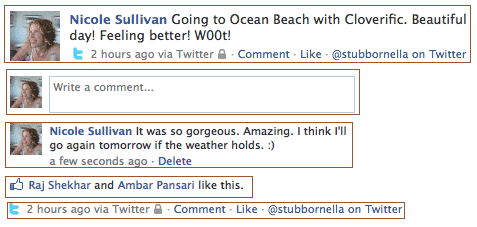

# 浅谈 Web 语义化

## 前言

想总结下关于 *Web* 语义化的知识，也查看了很多资料，但是这个领域貌似涉及的范围比较广吧，许多东西还是不甚理解，这里把一些我所理解的东西记录一下吧。若有什么疏漏和错误，欢迎批评指正。

## 什么是 *Web* 语义化

元素 (*Elements*)，属性 (*Attributes*)，属性值 (*Attribute values*) 被设计为带有确切的意思，即语义 (*Semantics*)。比如说，`table` 元素表示的是表格，`lang` 属性表示的是内容的语言。基本的语义可以帮助编写者更好地组织网站内容的结构，同时也方便浏览器和搜索引擎等 *html* 处理器解析网页内容。随着因特网的发展，网页的数量以惊人的速度不断增加，同时搜索引擎需要索引的页面也越来越多，但是 *html* 原本的语义还是太弱了，导致搜索引擎搜索的结果不够准确或者不够快，这样展现给用户的结果也不够理想。让搜索引擎等 *html* 处理器更好更快地处理页面信息，就是 *Web* 语义化要做的事，换句话说，*Web* 语义化就是让 *html* 页面具有更丰富的语义结构。

## 更富含语义的标签

HTML5新定义了很多富含语义的新标签，比如新的节 (*section*) 元素 `<section>`、`<hgroup>`、 `<article>`、`<nav>`、`<header>`、`<footer>` 和 `<aside>`，在定义不同的节 (*section*) 内容上很有帮助，也无需
担忧浏览器的支持，由 [*New semantic elements*](http://caniuse.com/#feat=html5semantic) 可以看到，除了 *IE 8* 即以下不支持 *html5* 新标签，其他所有浏览器都基本支持了。对于 *IE 8* 及以下版本，*html5* 标签和其他自定义标签会被当作 *HTMLUnknownElement*，而且会有一堆问题，想要兼容 *IE 8* 及以下版本的可以参考 [这里](http://diveintohtml5.info/semantics.html#unknown-elements) 解决。对于其他浏览器，是否可以用自定义的标签来丰富语义？是可以的，但要注意以下几点：

1. 所有的浏览器都会默认把 *unknown elements* 渲染为内联元素，要用块级元素要自己修改 `display` 值
2. 标签应该使用连字符避免与以后标准文档的标签冲突，比如 `<quite-good>`
3. *unknown elements* 是不会自闭合的，你需要手动添加闭合标签

官方文档的 [*Custom elements*](https://html.spec.whatwg.org/multipage/scripting.html#custom-elements) 也有自定义元素 *API*，不过 [浏览器支持度](http://caniuse.com/#feat=custom-elementsv1) 就有点悲伤了，你还可以使用 [Web Components](https://www.webcomponents.org/)。要说明的是，几乎所有搜索引擎都是无法识别自定义标签的，如果无法渲染一个自定义标签，搜索引擎也不会索引该标签中的内容，这对 *SEO (Search Engine Optimization)* 来说依然是个巨大的挑战。

## 标签中的类名如何写？

类名其实跟搜索引擎没有多大关系，因为搜索引擎无法从类名中得到语义信息，类名的主要作用是联系 *html* 和 外部 *CSS* 文件或 *JavaScript* 文件，但是这样就代表类名可以乱写吗？不是的！类名也是 *html* 语义的一部分，应该有其语义和目的。更规范的类名可以带来更大的效益，比如节省代码量，代码的可维护性更高等。

### 抽象出组件的结构

常见的类名都是根据标签包含的实质内容来写的，我发现自己也是这样的:)，这样有什么问题？首先，内容层的语义应该尽可能交给标签而非类名，当你使用一个特定的表示标签包含的本质内容的类名时，这个标签，或者说这个组件 (*component*)就被限制住了，它无法再存放其他内容了，就可复用性 (*reusability*) 来说，这是糟糕的。类名应该从重复的结构和功能模式中抽取得到 (我仿佛看到了设计模式的影子:)，嘿嘿)，看下面这张图。



从上到下的五个框看似不同，实则本质是相似的，每个框中左边都是一个媒体对象，可以是图片、视频、小图标之类的，右边则是描述内容，描述内容中可以包含其他的对象。对于这样抽象出来的组件，在给类名命名时，便可以脱离具体的内容，在 *CSS* 中也可以定义组件的通用样式，再视具体内容添加具体样式，这样就非常灵活了，可复用性也很强。

### *JavaScript* 专用类名

控制样式和控制行为的类名应当分开，这样就不致于因为类名的耦合问题在代码的后期维护中乱成一锅粥。当想通过类名操作 *DOM* 时，类名可以用 `js-*` 的格式，`*` 可以使用代表这个操作的行为的词，当不需要这个行为时，只需移除这个类名，对元素的样式不会有任何的影响，因为 `js-*` 是专门针对 *JavaScript* 的。

### 单类名 (*single-class*) 模式和多类名 (*multi-class*) 模式

单类名模式通常是这样的：

```html
.btn, .btn-primary { /* button template styles */ }
.btn-primary { /* styles specific to save button */ }

<button class="btn">Default</button>
<button class="btn-primary">Login</button>
```

多类名模式通常是这样的：

```html
.btn { /* button template styles */ }
.btn-primary { /* styles specific to primary button */ }

<button class="btn">Default</button>
<button class="btn btn-primary">Login</button>
```

对于第一种模式，你是对多个组件赋予相同的基本样式，然后再针对不同组件赋予额外的样式。问题在哪？这种模式是针对具体的组件设置额外的样式的，这意味着哪怕只是几种按钮的类型和几种按钮的尺寸的组合就会让你不得不增加数十个类名，某类按钮的改变也会导致多处样式的修改。对于第二种模式，只为多个组件设置最基本的样式，然后按类别 (按钮类型、尺寸等)划分类名，需要哪种按钮就组合哪些类名，不需要再额外增加类名，要修改样式也只需要修改相应类别的样式，这样代码的可维护性就提高了许多。

## Reference

* [HTML Standard - Semantics](https://html.spec.whatwg.org/multipage/dom.html#semantics-2)
* [HTML Standard - The elements of HTML](https://html.spec.whatwg.org/multipage/semantics.html#semantics)
* [What does it all mean?](http://diveintohtml5.info/semantics.html)
* [Web Components and SEO](http://react-etc.net/entry/web-components-seo)
* [Semantic HTML](http://justineo.github.io/slideshows/semantic-html/#/)
* [Is it OK to use unknown HTML tags?](http://stackoverflow.com/questions/10830682/is-it-ok-to-use-unknown-html-tags#answer-27869027)
* [About HTML semantics and front-end architecture](http://nicolasgallagher.com/about-html-semantics-front-end-architecture/)
* [The Media Object Saves Hundreds Of Lines Of Code](http://www.stubbornella.org/content/2010/06/25/the-media-object-saves-hundreds-of-lines-of-code/)